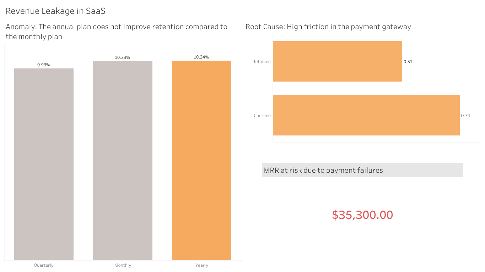

# SaaS Churn & Revenue Leakage Analysis

## Executive Summary
This data analytics and data engineering project identifies the key drivers of customer cancellation (Churn Rate) in a fictional SaaS company with 10,000 subscriptions. 

Through an ETL pipeline (Python), relational database design (MariaDB), and SQL analysis, there is a big retention issue **a high rate of Involuntary Churn** within annual plans due to friction in the billing system.

---

## Technical Architecture & Data Pipeline

The following workflow was implemented:

1. **Extraction & Cleaning (Python / Pandas):** Handled logical nulls, transformed categorical variables, and standardized boolean data types for storage optimization.
2. **Relational Modeling (Data Engineering):** Designed a normalized schema separating the data into Dimensions (`dim_clientes`, `dim_suscripciones`) and Fact Tables (`fact_comportamiento`).
3. **Loading & Querying (SQLAlchemy / MariaDB):** Automated ingestion into a local database.
   * Extracted key metrics (MRR, Churn Rate, Payment Failures) using complex queries with `JOINs` and aggregation functions.

---

## Business Insights & Discoveries

### 1. Anomaly in Annual Plan Retention
In a SaaS model, annual commitments should guarantee higher retention. However, the data revealed that **the Annual plan retains users at the same rate as the Monthly plan** (10.34% vs 10.33%). 

### 2. The Real Culprit: Payment Gateway Friction
By isolating annual plan users, customer support was ruled out as a reason for churn (ticket resolution times were identical for both retained and churned users). The critical differentiating factor was the billing system: **Payment failures were 45% higher (0.74 vs 0.51) among users who left the platform.**

---

## Strategic Recommendations
* **Implement a Dunning Process:** Set up automated emails 15 days before the annual renewal to encourage customers to update expired credit cards.
* **Projected Impact:** Save the $35,300 of MRR that is currently at risk due to renewal issues in all contracts.

---

## 📸 Dashboard Preview
*(Click the button above to view the interactive version)*

